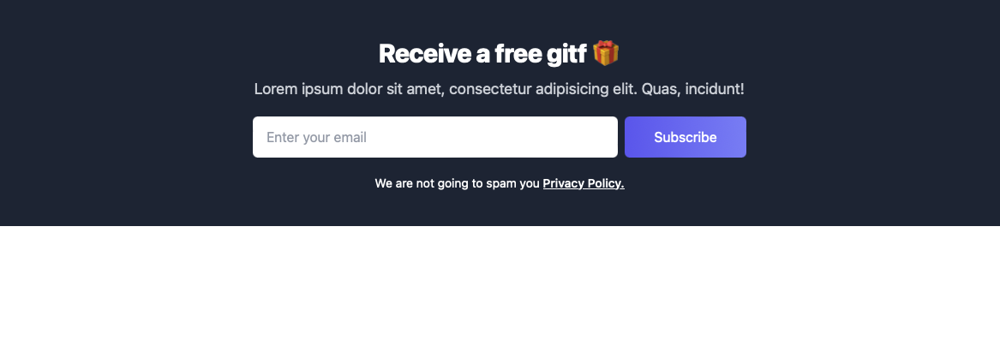
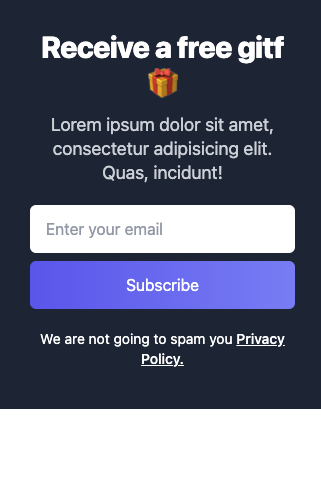

# TailwindCSS-Component: Newsletter Subscription Component

This repository hosts a modern and responsive newsletter subscription component designed with TailwindCSS. 
This component is perfect for websites looking to offer a subscription service or collect emails in a stylish, non-intrusive manner. 
Utilizing TailwindCSS via Play CDN, this component requires no local installation and can be added to any webpage with ease.

## Features

- Responsive layout for both desktop and mobile devices.
- Eye-catching design with a clear call-to-action.
- Simple integration using TailwindCSS Play CDN.
- Assurance of privacy with a link to the Privacy Policy.

## Preview

Desktop view:



Mobile view:



## Usage

To implement this component, simply include the HTML and CSS from the `newsletter.html` file in your project. Ensure the following TailwindCSS CDN link is present in your project's `<head>` section if it isn't already:

```html
<!-- TailwindCSS CDN for immediate use -->
<link href="https://cdn.tailwindcss.com" rel="stylesheet">
```

## Access

View the live demo of the newsletter subscription component here:
[https://tailwind-css-component-e-commerce-products-gallery.eliottdelhaye.com/](https://tailwind-css-component-e-commerce-products-gallery.eliottdelhaye.com/)
